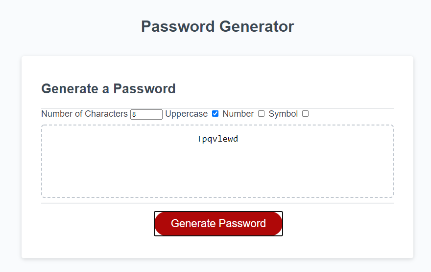
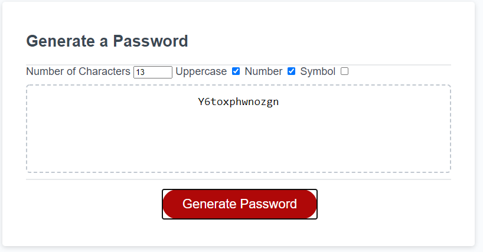
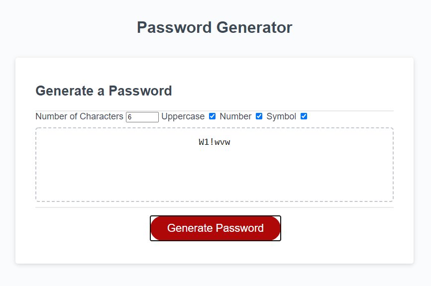

# random Password Generator

## Table of Contents

* [Description](#description)
* [Links](#links)
* [Screenshots](#screenshots)
* [Installation](#installation)
* [Usage](#usage)
* [Technologies Used](#technologies)
* [Questions](#questions)

## Description

This is a simple vinalla javascript application that can be used to generate a random password given the selected criteria. You can chose to add up to 50 charcters and have it include uppercase characters, numbers, and symbols. 

## Links

[Deployed Quiz App](https://benimahat1291.github.io/randomPasswordGEN/)

## Screenshots

## Installation Instructions

open index.html in you default web browser

## Usage

Select the number of characters you would like your password to contain, select if you would like it to include Uppercase, Numbers, and Symbols. Click the Generate Password button to generate a randomize unique password. 

## Technologies Used

HTML, CSS, JS

## Questions

If you have further projects and questions, you can find me on Github: [GITHUB](https://github.com/benimahat1291). 
please visit my portfolio to find contact information: [BENI MAHAT](https://benimahat1291.github.io/Portfolio_v2/#/). 

